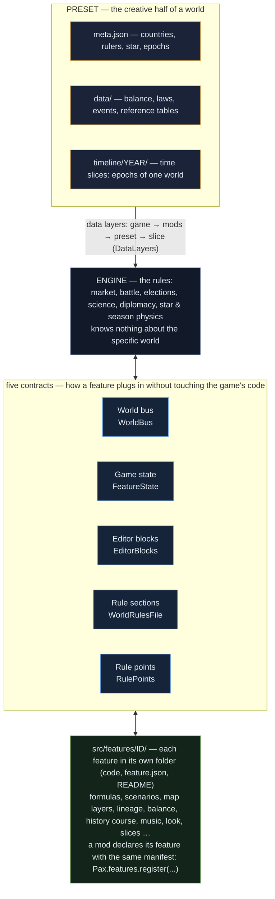

# 10. Features and the world bus: a mod as a first-class part of the game

The game is built from **features** — pieces that plug themselves in and know nothing about each other: world
formulas, scenarios, map layers, country lineage, seasonal snow. A mod plugs in **the same way** a built-in feature
does: it does not edit the game's code, it declares what it needs. The built-in features and the order of their
subscriptions are listed in the table at the end of this page.

Everything below goes through `Pax` (`Pax.bus`, `Pax.features`, `Pax.state`, `Pax.rule_points`, `Pax.world_rule`);
the full list is in the [API reference](api-reference.md).

## Diagram



The full, always-current list of features is in `docs/фичи.md` (generated from the manifests).

## The world bus: living inside the game step

Shared code emits events without knowing who listens. Subscribe, and your code is called at the right moment:

```gdscript
extends PaxMod

func _mod_loaded() -> void:
    Pax.bus.on("step_rules", Callable(self, "_my_week"), 50, id)   # the mod id owns the subscription

func _my_week(game: Node, days: int) -> void:
    pass   # your world step
```

| Event | Arguments | When |
|---|---|---|
| `step_begin` | `game, days` | a world step has started |
| `step_rules` | `game, days` | world rules: indicators, scenarios (order 10 — formulas, 20 — scenarios) |
| `loaded` | `game` | a game was loaded or started |
| `hud_built` | `game` | the HUD is built — add your button |
| `map_layers` | `game, indicators` | province indicators are computed — add your own layer |
| `map_pushed` | `game` | the map was refreshed |
| `resource_rows` | `panel, body` | rows of the resources panel |
| `lore` | `game, out` | the narrator's summary: add your line to `out` |
| `data_changed` | — | data layers changed (world, slice, mods) — drop your caches |

The number is the order: lower runs first (built-in features show theirs in the table below: `step_rules:10` means
order 10). Subscriptions made with the mod `id` are removed automatically when the mod is unloaded.

## Your own feature: game state and a switch for the world

A subscription is enough while the mod has nothing to store. If you need **game state**, declare a feature:

```gdscript
func _mod_loaded() -> void:
    Pax.features.register({
        "id": id, "optional": true,
        "title": {"ru": "Вера", "en": "Faith"},
        "scripts": ["res://mods/%s/faith.gd" % id],
    })
```

```gdscript
# mods/<id>/faith.gd
extends RefCounted

static func declare_state(fs: Object) -> void:
    # key, default value; personal — each player has their own; what to do on a time-machine
    # rollback ("keep" | "reset" | a function) and in a foreign epoch ("keep" | "reset")
    fs.declare("faith_shrines", [], {"personal": true, "rollback": "reset", "epoch": "reset"})

static func connect_bus(bus: Object) -> void:
    bus.on("step_rules", Callable(load("res://mods/my_mod/faith.gd"), "on_week"), 60, "my_mod")

static func on_week(game: Node, _days: int) -> void:
    var shrines: Array = Pax.state.value(game.model.features, "faith_shrines")
    shrines.append(game.model.sim.day)
```

What you get without a single line in the game's code: the value is **written to the save**, in multiplayer personal
state belongs to each player, and the time machine rolls it back by your rule. `"optional": true` lets a world author
switch the feature off in their world (`"features": {"off": ["<id>"]}` in the world's `meta.json`): it goes silent on
the bus while its state in the save stays intact.

## A block in the world editor

Does the world author need a settings block? Add it to the feature manifest:

```gdscript
"editor": [{"script": "res://mods/my_mod/faith_block.gd", "tab": "system", "order": 235, "scope": "slice"}],
```

```gdscript
# mods/<id>/faith_block.gd
extends RefCounted
const Kit = preload("res://src/editor/kit/EditorKit.gd")
const Doc = preload("res://src/editor/PresetDocument.gd")

static func block(editor) -> Control:
    var box := VBoxContainer.new()
    box.add_child(Kit.text("Faith", 16, Kit.ACCENT))
    var d = Doc.read_json(editor, "data/faith.json")          # slice → world
    var field := Kit.field(str((d if d is Dictionary else {}).get("creed", "")), 80)
    field.text_changed.connect(func(): Doc.write_json(editor, "data/faith.json", {"creed": field.text}))
    box.add_child(field)
    return box
```

- `tab`: `"system"` — the World tab, `"faction_card"` — a row in the country card (the function also receives the
  country index); your own tab — `"editor_tabs": [{"id": "faith", "title": "<language key>", "script": "res://…"}]`.
- `order` — the place among blocks (built-in ones go in steps of 10).
- `scope` — whose data it is: `"slice"` — a timeline slice has its own (the document writes to the world or to the
  open slice by itself), `"world"` — shared by the whole world (the block is not shown while a slice is open).
- `Kit` — label, hint, field, frame, header: the block looks native.

## Your own rule point: let the world author recompute your number

In fourteen places the game asks the world: "do you compute this number your own way?" (treasury income, birth rate,
army strength, legitimacy…). A mod adds its own points:

```gdscript
"rule_points": {"faith.tithe": {"names": ["believers", "treasury"], "label": {"ru": "Десятина", "en": "Tithe"}}},
```

```gdscript
var tithe: float = Pax.world_rule("faith.tithe", believers * 0.1, {"believers": believers, "treasury": money})
```

In the world editor, in the Formulas block, a "Tithe" row appears: the author writes a formula (`default * 2`,
`if(faith > 80, 0, default)`), where `default` is your number. No formula — your number comes back as is.
All the game's points: `Pax.rule_points.all()` and the file `data/rule_points.json` (you can also add your group with a
patch, `data/rule_points.patch.json`, without code).

## Your own section in the world rules

World rules live in `data/world_formulas.json`, and each section has its owner (`indicators`, `effects`, `rules` —
formulas; `triggers` — scenarios; `map_layers` — map layers; `windows` — windows). A mod can:

- **ship a section as a separate file**: `data/world/triggers.json` containing `{"triggers": [ … ]}` in the mod
  folder replaces only the scenarios and leaves the world's formulas alone (the same works in a world or slice folder);
- **add its own section**: `"sections": ["faith"]` in the feature manifest — the section is read together with the
  others (`data/world_formulas.json → "faith"` or `data/world/faith.json`), and editor blocks do not overwrite it.

## Checklist

- Register the feature in `_mod_loaded()` — before the player starts or loads a game.
- The feature name is the mod `id`; names of built-in features are taken.
- Do not call other features' scripts directly — their internals change. The contract is the bus events, the state
  keys and the data.

## Built-in features

The table is generated from the game's manifests. "World can switch off" — a world author may remove the feature.

<!-- features:begin -->
| Feature | What it is | World can switch off | Subscriptions (event:order) |
|---|---|---|---|
| `world_formulas` | World formulas and indicators | no | `step_begin`, `loaded`, `step_rules:10`, `lore:40`, `resource_rows` |
| `world_triggers` | Scenarios: when → if → then | yes | `step_rules:20` |
| `world_map_layers` | World map layers | yes | `map_layers` |
| `world_panels` | World windows | yes | `hud_built:20` |
| `lineage` | Country lineage | no | — |
| `map_snow` | Seasonal snow on the map | yes | `map_pushed` |
| `balance` | World balance | no | `data_changed` |
| `history_course` | History course | no | — |
| `world_goals` | World goals | yes | `lore:30` |
| `start_objects` | World objects on the map | yes | `lore:10` |
| `country_name` | Own country's title | no | — |
| `province_people` | People of provinces | no | `lore:20` |
| `world_windows` | Standard windows by world rules | yes | `hud_built:10` |
| `seasons` | World seasons | no | — |
| `world_models` | World 3D models | no | — |
| `start_diplomacy` | Wars and blocs at the start | no | — |
| `default_laws` | Default laws of the world | no | — |
| `space_start` | Space at the start and the goals block | no | — |
| `world_prologue` | World prologue | no | — |
| `world_music` | World music and sounds | no | — |
| `world_look` | World look: screens and video | no | — |
| `world_portraits` | World portraits | no | — |
| `world_voices` | Voices of the world's characters | no | — |
| `world_languages` | World languages: translating the texts | no | — |
| `world_terms` | The world's own terms | no | — |
| `world_theme` | World UI theme | no | — |
| `resource_icons` | World resource icons | no | — |
<!-- features:end -->
