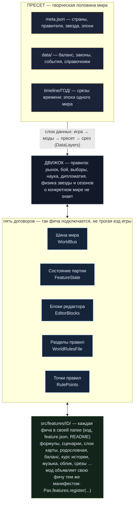

# 10. Фичи и шина мира: мод как полноправная часть игры

Игра собрана из **фич** — кусков, которые подключаются сами и не знают друг о друге: формулы мира, сценарии,
слои карты, родословная стран, снег по сезону. Мод подключается **тем же способом**, что и встроенная фича:
не правит код игры, а объявляет, что ему нужно. Встроенные фичи и порядок их подписок — в таблице в конце страницы.

Всё ниже — через `Pax` (`Pax.bus`, `Pax.features`, `Pax.state`, `Pax.rule_points`, `Pax.world_rule`), полный список — в
[справочнике API](../en/api-reference.md).

## Схема



Полный и всегда актуальный список фич — в `docs/фичи.md` (собирается из манифестов).

## Шина мира: жить в шаге игры

Общий код шлёт события, не зная, кто слушает. Подпишитесь — и ваш код зовут в нужный момент:

```gdscript
extends PaxMod

func _mod_loaded() -> void:
    Pax.bus.on("step_rules", Callable(self, "_my_week"), 50, id)   # id мода — владелец подписки

func _my_week(game: Node, days: int) -> void:
    pass   # ваш шаг мира
```

| Событие | Аргументы | Когда |
|---|---|---|
| `step_begin` | `game, days` | шаг мира начался |
| `step_rules` | `game, days` | правила мира: показатели, сценарии (порядок 10 — формулы, 20 — сценарии) |
| `loaded` | `game` | партия загружена или начата |
| `hud_built` | `game` | собран HUD — можно добавить кнопку |
| `map_layers` | `game, indicators` | посчитаны показатели провинций — можно дописать свой слой |
| `map_pushed` | `game` | карта обновлена |
| `resource_rows` | `panel, body` | строки панели ресурсов |
| `lore` | `game, out` | сводка рассказчику: допишите свою строку в `out` |
| `data_changed` | — | сменились слои данных (мир, срез, моды) — сбросьте свои кэши |

Число — порядок: меньше — раньше (у встроенных фич он указан в таблице ниже: `step_rules:10` — порядок 10).
Подписки с `id` мода снимаются сами, когда мод выгружается.

## Своя фича: состояние партии и выключатель для мира

Подписки хватает, пока моду нечего хранить. Если нужно **состояние партии** — объявите фичу:

```gdscript
func _mod_loaded() -> void:
    Pax.features.register({
        "id": id, "optional": true,
        "title": {"ru": "Вера", "en": "Faith"},
        "scripts": ["res://mods/%s/faith.gd" % id],
    })
```

```gdscript
# mods/<id>/faith.gd
extends RefCounted

static func declare_state(fs: Object) -> void:
    # ключ, значение по умолчанию; personal — у каждого игрока своё; что делать при откате
    # машиной времени ("keep" | "reset" | функция) и в чужой эпохе ("keep" | "reset")
    fs.declare("faith_shrines", [], {"personal": true, "rollback": "reset", "epoch": "reset"})

static func connect_bus(bus: Object) -> void:
    bus.on("step_rules", Callable(load("res://mods/my_mod/faith.gd"), "on_week"), 60, "my_mod")

static func on_week(game: Node, _days: int) -> void:
    var shrines: Array = Pax.state.value(game.model.features, "faith_shrines")
    shrines.append(game.model.sim.day)
```

Что это даёт без единой строки в коде игры: значение **пишется в сейв**, в сетевой игре личное состояние у
каждого игрока своё, машина времени откатывает его по вашему правилу. `"optional": true` — автор мира может
выключить фичу у себя (`"features": {"off": ["<id>"]}` в `meta.json` мира): она замолчит на шине, а её состояние
в сейве останется целым.

## Блок в редакторе мира

Автору мира нужен блок настроек? Допишите в манифест фичи:

```gdscript
"editor": [{"script": "res://mods/my_mod/faith_block.gd", "tab": "system", "order": 235, "scope": "slice"}],
```

```gdscript
# mods/<id>/faith_block.gd
extends RefCounted
const Kit = preload("res://src/editor/kit/EditorKit.gd")
const Doc = preload("res://src/editor/PresetDocument.gd")

static func block(editor) -> Control:
    var box := VBoxContainer.new()
    box.add_child(Kit.text("Вера", 16, Kit.ACCENT))
    var d = Doc.read_json(editor, "data/faith.json")          # срез → мир
    var field := Kit.field(str((d if d is Dictionary else {}).get("creed", "")), 80)
    field.text_changed.connect(func(): Doc.write_json(editor, "data/faith.json", {"creed": field.text}))
    box.add_child(field)
    return box
```

- `tab`: `"system"` — вкладка «Мир», `"faction_card"` — строка в карточке страны (функция получит ещё номер страны);
  своя вкладка — `"editor_tabs": [{"id": "faith", "title": "<ключ языка>", "script": "res://…"}]`.
- `order` — место среди блоков (встроенные идут с шагом 10).
- `scope` — чьи данные: `"slice"` — у среза хронологии свои (документ сам пишет в мир или в открытый срез),
  `"world"` — общие для всего мира (в открытом срезе блок не показывается).
- `Kit` — подпись, подсказка, поле, рамка, заголовок: блок выглядит как родной.

## Своя точка правил: пусть автор мира пересчитает ваше число

Игра в четырнадцати местах спрашивает мир: «это число ты считаешь по-своему?» (доход казны, рождаемость,
сила армии, легитимность…). Мод добавляет свои точки:

```gdscript
"rule_points": {"faith.tithe": {"names": ["believers", "treasury"], "label": {"ru": "Десятина", "en": "Tithe"}}},
```

```gdscript
var tithe: float = Pax.world_rule("faith.tithe", believers * 0.1, {"believers": believers, "treasury": money})
```

В редакторе мира, в блоке «Формулы», появится строка «Десятина»: автор пишет формулу
(`default * 2`, `если(вера > 80, 0, default)`), `default` — ваше число. Нет формулы — вернётся ваше число как есть.
Все точки игры — `Pax.rule_points.all()` и файл `data/rule_points.json` (свою группу можно добавить и заплаткой
`data/rule_points.patch.json`, без кода).

## Свой раздел в правилах мира

Правила мира лежат в `data/world_formulas.json`, у каждого раздела свой хозяин (`indicators`, `effects`, `rules` —
формулы; `triggers` — сценарии; `map_layers` — слои карты; `windows` — окна). Мод может:

- **положить свой раздел отдельным файлом**: `data/world/triggers.json` с содержимым `{"triggers": [ … ]}` в папке
  мода заменит только сценарии, не трогая формулы мира (так же — в папке мира и среза);
- **завести свой раздел**: `"sections": ["faith"]` в манифесте фичи — раздел читается вместе с остальными
  (`data/world_formulas.json → "faith"` или `data/world/faith.json`), а блоки редактора его не затирают.

## Памятка

- Регистрируйте фичу в `_mod_loaded()` — до того, как игрок начнёт или загрузит партию.
- Имя фичи = `id` мода; имена встроенных фич заняты.
- Не обращайтесь к скриптам чужих фич напрямую — их внутренности меняются. Договор — события шины, ключи
  состояния и данные.

## Встроенные фичи

Таблица собирается из манифестов игры. «Выключается миром» — автор мира может убрать фичу у себя.

<!-- features:begin -->
| Фича | Что это | Выключается миром | Подписки (событие:порядок) |
|---|---|---|---|
| `world_formulas` | Формулы и показатели мира | нет | `step_begin`, `loaded`, `step_rules:10`, `lore:40`, `resource_rows` |
| `world_triggers` | Сценарии «когда → если → то» | да | `step_rules:20` |
| `world_map_layers` | Свои слои карты | да | `map_layers` |
| `world_panels` | Свои окна мира | да | `hud_built:20` |
| `lineage` | Родословная стран | нет | — |
| `map_snow` | Снег на карте по сезону | да | `map_pushed` |
| `balance` | Баланс мира | нет | `data_changed` |
| `history_course` | Курс истории | нет | — |
| `world_goals` | Цели мира | да | `lore:30` |
| `start_objects` | Объекты мира на карте | да | `lore:10` |
| `country_name` | Название своей страны | нет | — |
| `province_people` | Люди провинций | нет | `lore:20` |
| `world_windows` | Штатные окна по правилам мира | да | `hud_built:10` |
| `seasons` | Времена года мира | нет | — |
| `world_models` | 3D-модели мира | нет | — |
| `start_diplomacy` | Войны и блоки на старте | нет | — |
| `default_laws` | Законы мира по умолчанию | нет | — |
| `space_start` | Космос на старте и блок целей | нет | — |
| `world_prologue` | Пролог мира | нет | — |
| `world_music` | Музыка и звуки мира | нет | — |
| `world_look` | Облик мира: заставки и видео | нет | — |
| `world_portraits` | Портреты мира | нет | — |
| `world_voices` | Голоса персонажей мира | нет | — |
| `world_languages` | Языки мира: перевод текстов | нет | — |
| `world_terms` | Свои термины мира | нет | — |
| `world_theme` | Тема интерфейса мира | нет | — |
| `resource_icons` | Значки ресурсов мира | нет | — |
<!-- features:end -->
